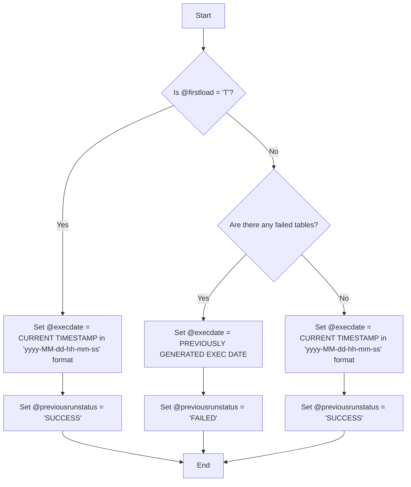

```mermaid
   graph TD
    A[Start] --> B{Is @firstload = 'T'?}
    B -- Yes --> C[Set @execdate = CURRENT TIMESTAMP in 'yyyy-MM-dd-hh-mm-ss' format]
    C --> D[Set @previousrunstatus = 'SUCCESS']
    D --> I[End]
    B -- No --> L{Are there any failed tables?}
    L -- Yes --> M[Set @execdate = PREVIOUSLY GENERATED EXEC DATE ]
    M --> N[Set @previousrunstatus = 'FAILED']
    N --> I[End]
    L -- No --> O[Set @execdate = CURRENT TIMESTAMP in 'yyyy-MM-dd-hh-mm-ss' format]
    O --> P[Set @previousrunstatus = 'SUCCESS']
    P --> I[End]
```
