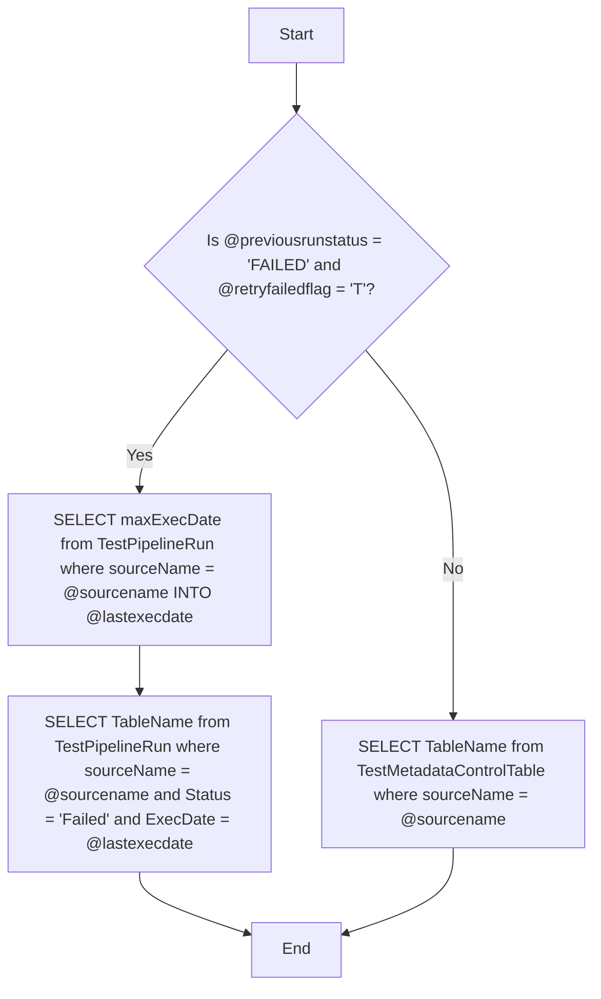

```mermaid
graph TD
    A[Start] --> B{Is @previousrunstatus = 'FAILED' and @retryfailedflag = 'T'?}
    B --> |Yes| C[SELECT maxExecDate from TestPipelineRun where sourceName = @sourcename INTO @lastexecdate]
    C --> D[SELECT TableName from TestPipelineRun where sourceName = @sourcename and Status = 'Failed' and ExecDate = @lastexecdate]
    B --> |No| E[SELECT TableName from TestMetadataControlTable where sourceName = @sourcename]
    D --> F[End]
    E --> F

```
